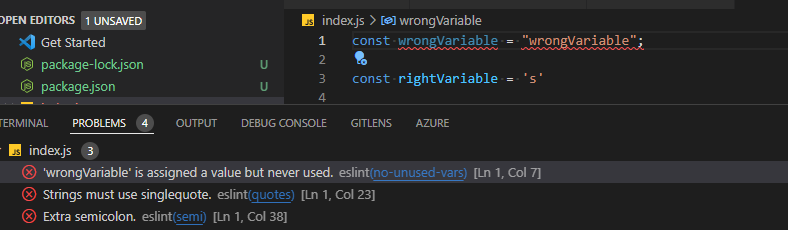

# How to configure standard js in eslint

The goal of this guide is to help you configure eslint to work with standardJS on visual studio code and help you to write better quality code and avoid bugs.



## Requirements

+ Install Extension [ESLint](https://marketplace.visualstudio.com/items?itemName=dbaeumer.vscode-eslint) to automatically lint your code on vs code.

## Install

You need to install standardJS executing the following command:

```bash
    npm install
```

To know more about standard JS, check this [link](https://standardjs.com/)